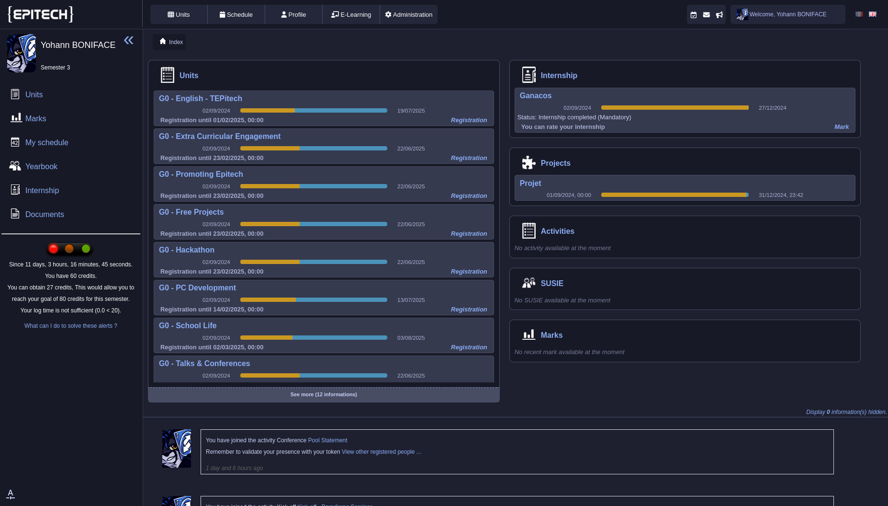
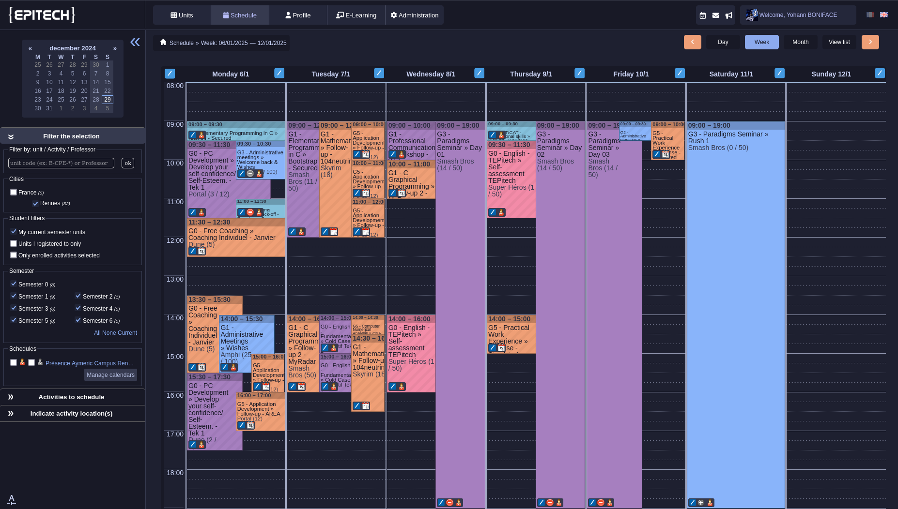

# Catppuccin Theme for the Epitech Intranet

## Install

1 - Get the stylus extension for your navigator:

- [Stylus on Firefox](https://addons.mozilla.org/en-US/firefox/addon/styl-us/)

- [Stylus on Chrome](https://chromewebstore.google.com/detail/stylus/clngdbkpkpeebahjckkjfobafhncgmne?pli=1)

2 - Go to https://userstyles.world/style/20076/catppuccin-intranet and click `install`

